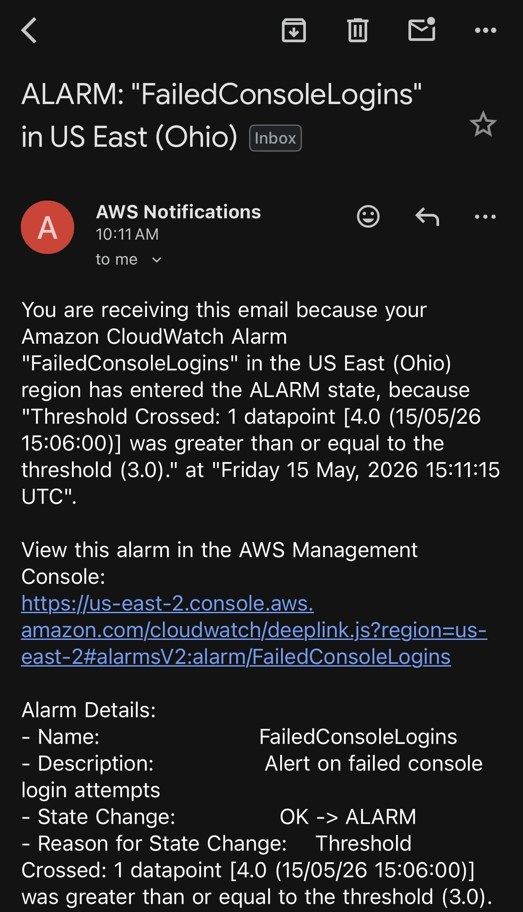
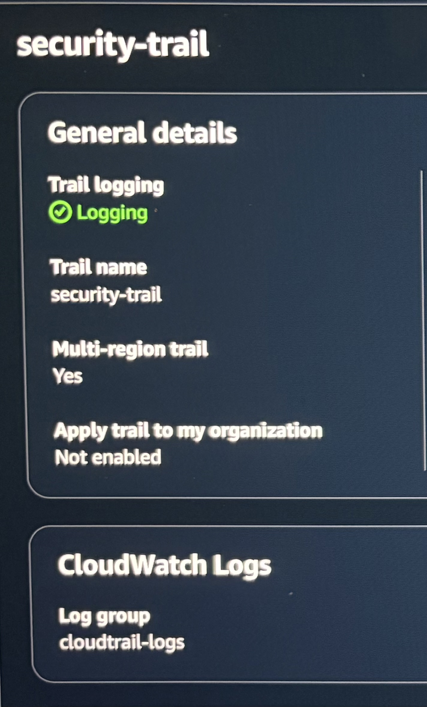
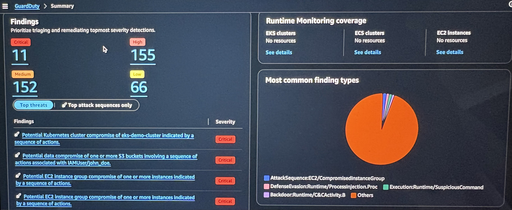
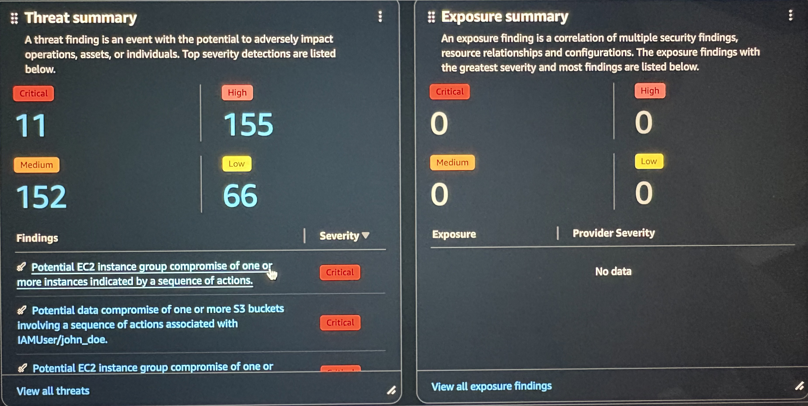
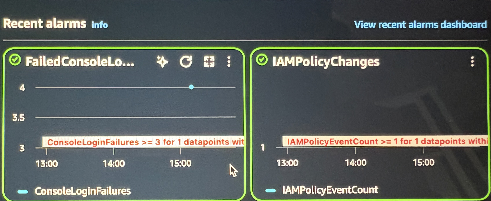
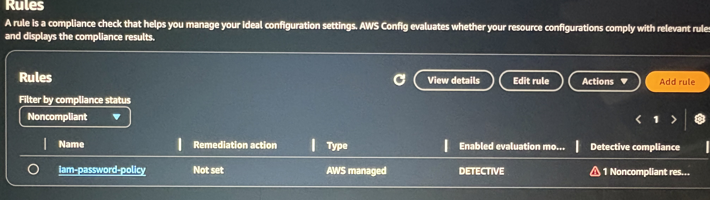
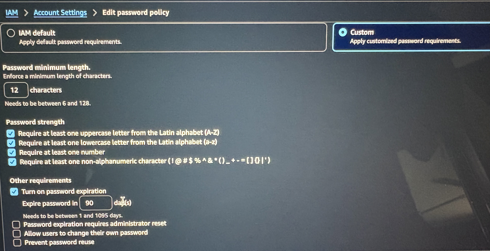
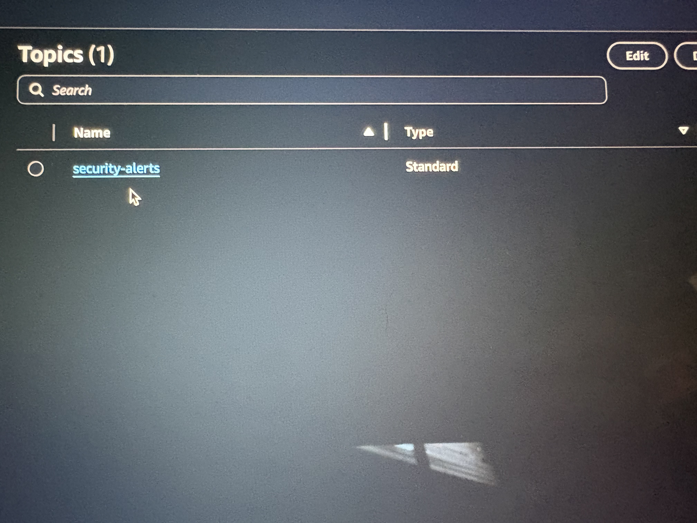

AWS Threat Detection Lab

A cloud security monitoring lab built on native AWS services to detect unauthorized access attempts, IAM privilege escalation, and root account compromise with real-time email alerting.
Overview

This project simulates a Security Operations Center (SOC) monitoring environment using native AWS services. The project mirrors how a security team detects and responds to threats in cloud environments.

Implementing the following:
CloudTrail captures every API call, login attempt, and configuration changes made in the AWS account.

CloudWatch evaluates logs against custom detection rules and triggers alarms when those rules are broken.

SNS delivers immediate email alerts when suspicious behavior is detected.

GuardDuty works alongside this setup to provide machine learning-based threat detection. It flags findings such as EC2 compromise and S3 data exposure attempts that normal rule-based alarms would miss.

AWS Config enforces compliance baselines and flags resources that drift outside defined security policies.
I simulated attack scenarios such as:

Failed console login attempts that trigger brute force detection
IAM policy modification to simulate privilege escalation attempts
EC2 compromise simulation validated against GuardDuty findings
S3 data exposure attempt validated against GuardDuty findings

Detection Rules
Failed Console Logins-
CloudWatch alarm triggers after 3 failed login attempts within a defined period. This validates brute force login attempts.

Root Account Access-
Alarm fires anytime the root account is used. Root usage outside of initial setup suggests a possible compromise.

IAM Policy Changes-
CloudTrail metric filter detects unauthorized or unexpected IAM policy escalation attempts.

Proof of Detection
Screenshots of alerts can be found in the /Screenshots folder of these events:
### SNS Email Alert — Failed Console Logins

### CloudTrail Logging Configuration

### GuardDuty Simulated Findings

### GuardDuty Threat Summary

### CloudWatch Alarm History — Failed Logins and IAM Policy Changes

### IAM Policy Rule Configuration

### Password Policy Rules

### SNS Security Alerts Topic

Learning experience-
What I learned most about building this lab was the core workflow of cloud security operations. how logs flow from activity to detection to alerting in a real AWS environment. It also taught me the difference between rule-based detection and behavioral detection and how they work alongside each other to catch what the other service may have missed.

In Progress-
When working through this detection lab I had one question: "What is stopping someone from going through with these actions?" These are simply alerts, but cybersecurity is more than alerting — it is also about how we respond to those alerts. I will be automating a threat response to these alerts using AWS Lambda, which will be triggered by GuardDuty findings to isolate compromised resources without manual intervention.
Next Project

For my next project I will be applying the skills of response, alerting, and monitoring to an Azure environment with a deliberately exposed honeypot to capture and triage real world brute force attacks from global threat actors.
